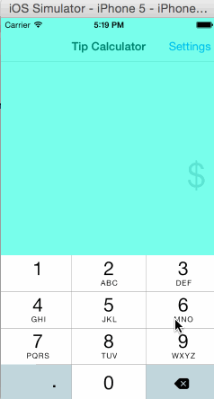

Tippy
==================

Tip Calculator app for CodePath Application

Time spent: 16 hours total

Completed Task:

* [x] Required: Basic tip calculator functionality
* [x] Required: Settings page
* [x] Optional: View animation
* [x] Optional: Remember the bill amount across app
* restarts (within 5 mins)
* [x] Optional: Use locale specific currency and currency thousands separators
* [x] Additional: Keyboard launch immediately so user can start entering tip amount immediately.
* [x] Additional: Allow splitting bills for up to 6 persons.

**Demo**

GIF created with [LiceCap](http://www.cockos.com/licecap/).

Open-source libraries used:

[FontAwesome+iOS](https://github.com/alexdrone/ios-fontawesome)